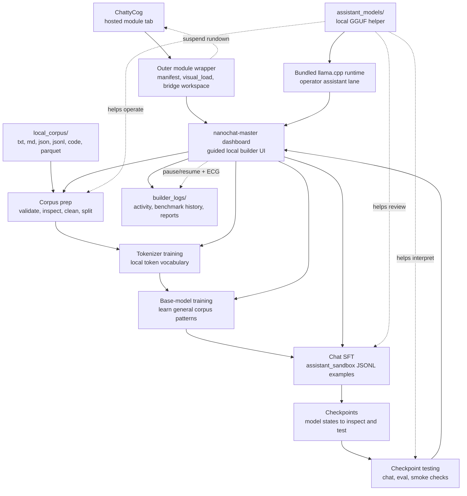

# LLM Tweaker Builder

LLM Tweaker Builder is a local-first fork built around Andrej Karpathy's `nanochat`, adapted into a guided builder dashboard with a GGUF helper assistant and drop-in ChattyCog module packaging. It is designed for people who want a more approachable path into local corpus prep, tokenizer training, base-model training, chat SFT, and checkpoint testing without losing sight of the upstream nanochat lineage.

Notable local-builder additions include:

- `.parquet` corpus support alongside the original text/code path
- hardware-fit runtime defaults for consumer machines
- pause and resume for long local jobs
- a dashboard ECG window that gives a live visual answer to whether the machine is active, idle, or potentially stalled

This package is aimed at users who may be new to:

- local model tooling
- tokenizer and base-model training
- SFT dataset preparation
- ChattyCog module hosting

If you are starting from zero, begin with:

- [nanochat-master/ZERO_EXPERIENCE_END_TO_END_GUIDE.md](nanochat-master/ZERO_EXPERIENCE_END_TO_END_GUIDE.md)
- [nanochat-master/LOCAL_BUILDER_USER_MANUAL.md](nanochat-master/LOCAL_BUILDER_USER_MANUAL.md)

If you want the short version:

1. Put this `llm-tweaker` folder into your own `chatty-cog/modules/` folder.
2. In ChattyCog, use `Modules -> Rescan modules`.
3. Open `LLM Tweaker Builder`.
4. Put a helper `.gguf` in `nanochat-master/Assistant_models/`.
5. Put a small real corpus in `nanochat-master/local_corpus/`.
6. Launch the dashboard and follow the guided builder flow.

## Builder Flow Map

## Related Docs

- [GLOSSARY.md](GLOSSARY.md)

## What This Repo Does

This repo packages the local builder dashboard from the nested `nanochat-master/` app and adds a lightweight ChattyCog hosting layer. The ChattyCog wrapper only adds:

- module discovery metadata
- hosted webview loading
- bridge-side workspace fields
- ChattyCog suspend-rundown integration

The training dashboard itself lives in:

- [nanochat-master](nanochat-master)

## Folder Layout

- [manifest.json](manifest.json)
  ChattyCog discovery metadata.
- [visual_load.json](visual_load.json)
  Tells ChattyCog how to host the dashboard.
- [HANDSHAKE.md](HANDSHAKE.md)
  Cross-module identity and handoff guidance.
- [ui.json](ui.json)
  Optional bridge-side workspace fields inside ChattyCog.
- [start-builder.cmd](start-builder.cmd)
  Local launcher wrapper used by ChattyCog.
- [nanochat-master](nanochat-master)
  The actual local builder application and its upstream-derived codebase.

## Licensing Boundary

This module contains a mix of upstream and local work.

- The ChattyCog wrapper layer in this outer module folder is intended to be distributed under AGPLv3. See [LICENSE](LICENSE).
- The nested upstream-derived builder app in [nanochat-master](nanochat-master) carries its own MIT license. See [nanochat-master/LICENSE](nanochat-master/LICENSE).

In plain language:

- files in the outer module wrapper are the ChattyCog integration layer
- files inside `nanochat-master/` follow the upstream nanochat licensing where applicable

If you redistribute this package, keep both license files and preserve attribution for the upstream project.

## Upstream Credit

This builder is based on Andrej Karpathy's `nanochat` project and then adapted into a local-first builder workflow with a hosted ChattyCog module wrapper.

For upstream project information, see:

- [nanochat-master/README.md](nanochat-master/README.md)
